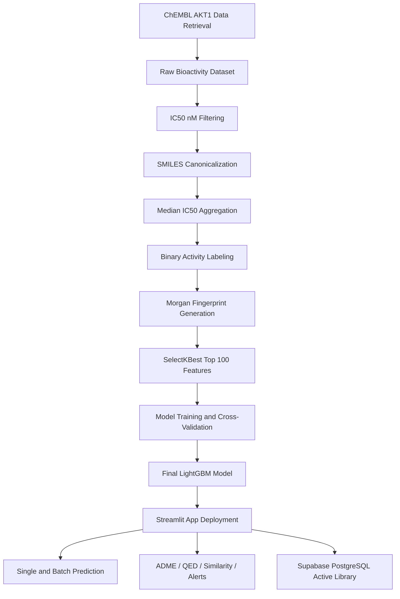

# 🎗️ AKT-Scan AI


---

## 📌 Project Title

**AKT-Scan AI: A High-Throughput Machine Learning Platform for SMILES-Based Bioactivity Screening and Drug-Likeness Profiling Targeting AKT1**

---

## 🌿 Overview

**AKT-Scan AI** is a Python-based machine learning and cheminformatics platform developed for the rapid virtual screening of small molecules against **AKT1**.

The platform combines:

- ChEMBL-derived AKT1 bioactivity data
- RDKit-based molecular fingerprinting
- Feature selection using SelectKBest
- LightGBM-based binary classification
- Five-fold cross-validation and external validation
- Drug-likeness and ADME profiling
- Scaffold similarity analysis against AKT inhibitor references
- Prediction confidence estimation
- Applicability-domain assessment
- PAINS and Brenk structural-alert screening
- Streamlit-based interactive deployment
- Supabase PostgreSQL-backed predicted active compound database

The goal of AKT-Scan AI is to support early-stage anticancer compound prioritization by identifying molecules that are predicted to be active against AKT1 and by enriching these predictions with medicinal chemistry interpretation.

---

## 🧬 Target Protein

| Item | Description |
|---|---|
| Target | AKT1 |
| ChEMBL Target ID | `CHEMBL4282` |
| Protein | RAC-alpha serine/threonine-protein kinase |
| Organism | *Homo sapiens* |
| Application focus | AKT1-targeted anticancer bioactivity screening |

AKT1 is a key kinase involved in cell survival, proliferation, metabolism, and cancer-associated signaling pathways. Because AKT signaling is frequently dysregulated in cancer, AKT1 is an important target for anticancer drug discovery and inhibitor screening.

---

## 🧪 Key Features

### 🔹 Machine Learning

- LightGBM-based final classifier
- Morgan fingerprint molecular representation
- Top 100 fingerprint features selected using SelectKBest
- SMOTE-based imbalance handling
- Hyperparameter tuning using RandomizedSearchCV
- Five-fold stratified cross-validation
- Independent external validation

### 🔹 Cheminformatics

- SMILES parsing and canonicalization using RDKit
- Morgan fingerprints with radius 2 and 2048 bits
- ADME and drug-likeness descriptor calculation
- QED score calculation
- Lipinski, Veber, Ghose, Egan, and Muegge rule evaluation
- PAINS and Brenk structural-alert screening

### 🔹 Bioactivity Screening

- Single-molecule prediction
- Batch screening from pasted SMILES
- Batch screening from CSV upload
- Probability-based Active/Inactive classification
- Adjustable activity threshold
- Downloadable prediction results

### 🔹 Interpretability and Reliability

- Prediction confidence margin
- Applicability-domain estimation
- Scaffold similarity against AKT inhibitor references
- Tanimoto similarity ranking
- Structural-alert summary

### 🔹 Database Integration

- Supabase PostgreSQL backend
- Predicted Active Compound Database
- Canonical SMILES-based duplicate control
- Stable AKT-ACT compound identifier generation
- Contributor metadata collection with user consent
- Downloadable active compound database

---

## 🧠 Repository Keywords / Suggested GitHub Topics

```text
akt1
akt-inhibitor
drug-discovery
machine-learning
lightgbm
chembl
rdkit
cheminformatics
morgan-fingerprint
streamlit
supabase
postgresql
bioactivity-prediction
virtual-screening
adme
qed
pains
brenk
cancer-research
```

---

## 🧭 Complete Workflow



---

# 🧾 Dataset Collection

## Source Database

Bioactivity data were collected from **ChEMBL** using the official ChEMBL Python webresource client.

The AKT1 target identifier used was:

```python
TARGET_ID = "CHEMBL4282"
```

The initial ChEMBL query retrieved activity records for:

```text
IC50
Ki
Kd
```

Only records with:

```text
standard_units = nM
confidence_score >= 7
```

were retained.

The downloaded columns were:

```text
molecule_chembl_id
canonical_smiles
standard_type
standard_value
standard_units
```

The raw dataset was saved as:

```text
chembl_AKT_raw.csv
```

---

## ChEMBL Data Download Script

```python
from chembl_webresource_client.new_client import new_client
import pandas as pd

TARGET_ID = "CHEMBL4282"

activity = new_client.activity
res = activity.filter(
    target_chembl_id=TARGET_ID,
    standard_type__in=["IC50", "Ki", "Kd"],
    standard_units="nM",
    confidence_score__gte=7
)

df = pd.DataFrame(res)

df = df[
    [
        "molecule_chembl_id",
        "canonical_smiles",
        "standard_type",
        "standard_value",
        "standard_units"
    ]
]

df = df.dropna(subset=["canonical_smiles", "standard_value"])
df["standard_value"] = pd.to_numeric(df["standard_value"], errors="coerce")

df.to_csv("chembl_AKT_raw.csv", index=False)

print("Downloaded molecules:", len(df))
```

---

# 🧹 Dataset Preparation

Although IC50, Ki, and Kd values were initially retrieved, the final supervised machine-learning dataset was prepared using only:

```text
IC50 values reported in nM
```

This was done to maintain assay-type consistency during model development.

---

## Dataset Curation Steps

The dataset preparation workflow included the following steps:

1. Load raw ChEMBL AKT1 activity data.
2. Retain only `IC50` values in `nM`.
3. Remove rows with missing SMILES.
4. Canonicalize SMILES using RDKit.
5. Remove invalid molecules.
6. Aggregate duplicate molecules by canonical SMILES.
7. Use the median IC50 value for compounds with multiple activity records.
8. Assign binary activity labels.
9. Remove ambiguous intermediate compounds.
10. Save the final training dataset.

---

## Activity Labeling Criteria

Compounds were labeled using the following IC50 cutoffs:

| Activity Class | IC50 Criterion | Label |
|---|---:|---:|
| Active | IC50 ≤ 100 nM | `1` |
| Inactive | IC50 ≥ 1000 nM | `0` |
| Ambiguous | 100 nM < IC50 < 1000 nM | Removed |

The ambiguous region between 100 and 1000 nM was excluded to create a cleaner binary classification problem.

---

## Final Training Dataset

The final curated AKT1 training dataset contained:

| Class | Label | Number of Compounds |
|---|---:|---:|
| Active | `1` | 467 |
| Inactive | `0` | 934 |
| Total | - | 1401 |

The dataset was saved as:

```text
test_train_data.csv
```

For model training, the columns were standardized to:

```text
SMILES
Label
```

where:

```text
Label = 1  → Active
Label = 0  → Inactive
```

---

## Dataset Preparation Script

```python
import pandas as pd
from rdkit import Chem
from rdkit.Chem import MolToSmiles
import os

INPUT_FILE = "chembl_AKT_raw.csv"
OUTPUT_FILE = "test_train_data.csv"
LOG_FILE = "dataset_log.txt"

ACTIVE_CUTOFF = 100
INACTIVE_CUTOFF = 1000

df = pd.read_csv(INPUT_FILE)
print(f"Raw dataset: {df.shape[0]} rows")

df = df[(df['standard_type'] == "IC50") & (df['standard_units'] == "nM")]
print(f"After filtering IC50 nM: {df.shape[0]} rows")

df = df.dropna(subset=['canonical_smiles'])
print(f"After removing missing SMILES: {df.shape[0]} rows")

def canonicalize(smiles):
    try:
        mol = Chem.MolFromSmiles(smiles)
        if mol is None:
            return None
        return MolToSmiles(mol, canonical=True)
    except:
        return None

df['canonical_smiles'] = df['canonical_smiles'].apply(canonicalize)
df = df.dropna(subset=['canonical_smiles'])
print(f"After canonicalization: {df.shape[0]} rows")

agg_df = df.groupby('canonical_smiles')['standard_value'].median().reset_index()
agg_df = agg_df.rename(columns={'standard_value': 'median_IC50_nM'})

agg_df = agg_df.merge(
    df[['canonical_smiles', 'molecule_chembl_id']].drop_duplicates('canonical_smiles'),
    on='canonical_smiles',
    how='left'
)

print(f"Unique molecules after aggregation: {agg_df.shape[0]}")

def label_ic50(ic50):
    if ic50 <= ACTIVE_CUTOFF:
        return 1
    elif ic50 >= INACTIVE_CUTOFF:
        return 0
    else:
        return None

agg_df['label'] = agg_df['median_IC50_nM'].apply(label_ic50)

agg_df = agg_df.dropna(subset=['label'])
agg_df['label'] = agg_df['label'].astype(int)

print(f"Dataset after labeling: {agg_df.shape[0]} rows")
print(f"Actives: {agg_df['label'].sum()}, Inactives: {agg_df.shape[0] - agg_df['label'].sum()}")

agg_df = agg_df.drop_duplicates(subset=['canonical_smiles'])
print(f"Final dataset after removing duplicates: {agg_df.shape[0]} rows")

agg_df = agg_df[['molecule_chembl_id', 'canonical_smiles', 'median_IC50_nM', 'label']]
agg_df.to_csv(OUTPUT_FILE, index=False)

with open(LOG_FILE, 'w') as f:
    f.write(f"Raw rows: {df.shape[0]}\n")
    f.write(f"Unique molecules after aggregation: {agg_df.shape[0]}\n")
    f.write(f"Actives (<= {ACTIVE_CUTOFF} nM): {agg_df['label'].sum()}\n")
    f.write(f"Inactives (>= {INACTIVE_CUTOFF} nM): {agg_df.shape[0] - agg_df['label'].sum()}\n")

print(f"Dataset saved to {OUTPUT_FILE}")
print(f"Log saved to {LOG_FILE}")
```

---

# 🌍 External Validation Dataset

An independent external validation dataset was prepared using compounds that were **not included in model training**.

The external validation dataset contained:

| Class | Number of Compounds |
|---|---:|
| Active | 250 |
| Inactive | 250 |
| Total | 500 |

This dataset was used only for final external validation of the trained model.

---

# 🧬 Molecular Representation

Each compound was represented using a binary Morgan fingerprint generated from its SMILES structure.

Fingerprint settings:

| Parameter | Value |
|---|---:|
| Fingerprint type | Morgan fingerprint |
| Radius | 2 |
| Number of bits | 2048 |
| Software | RDKit |

The fingerprint generation workflow was:

```text
SMILES → RDKit molecule → Morgan fingerprint → 2048-bit vector
```

Invalid SMILES strings were removed from model training and flagged during application inference.

---

# 🔬 Feature Selection

Feature selection was performed using:

```python
SelectKBest(score_func=mutual_info_classif, k=100)
```

From the original 2048-bit Morgan fingerprint, the top:

```text
100 fingerprint features
```

were selected.

The selected features were saved as:

```text
selected_feature_indices.npy
```

This file is essential for deployment because the Streamlit app must apply the same selected feature indices before prediction.

---

## Feature Selection Strategy

During cross-validation, feature selection was applied only on the training portion of each fold and then transformed onto the test fold. This helped reduce data leakage.

During final model training, SelectKBest was refitted on the full training dataset, and the selected top 100 feature indices were saved for deployment.

---

# Machine Learning Model Development

## Models Evaluated

Several supervised classification models were evaluated:

| Model |
|---|
| Random Forest |
| Support Vector Machine |
| K-Nearest Neighbors |
| XGBoost |
| LightGBM |
| Extra Trees |
| Soft-Voting Ensemble |

The final deployed model was:

```text
LightGBM Classifier
```

---

## Class Imbalance Handling

The final training dataset had an imbalanced class distribution:

```text
467 actives
934 inactives
```

To reduce class imbalance effects, SMOTE oversampling was used within the training pipeline.

SMOTE was applied only inside the training folds during model development to avoid information leakage.

---

## Hyperparameter Optimization

Hyperparameter tuning was performed using:

```python
RandomizedSearchCV
```

The scoring metric for hyperparameter optimization was:

```text
ROC-AUC
```

For LightGBM, the search space included:

```text
n_estimators
max_depth
learning_rate
num_leaves
subsample
```

---

## Cross-Validation

Model performance was evaluated using:

```text
Five-fold stratified cross-validation
```

The training script also used nested cross-validation logic:

| Cross-validation level | Purpose |
|---|---|
| Outer 5-fold CV | Model evaluation |
| Inner 3-fold CV | Hyperparameter tuning |

A random seed of 42 was used for reproducibility.

---

## Train/Test Splitting

In addition to cross-validation, an 80:20 train/test split was used during model development.

The overall training strategy included:

```text
80:20 train/test split
Five-fold stratified cross-validation
Independent external validation
```

---

# 📊 Model Performance

## Five-Fold Cross-Validation Performance

| Metric | Score |
|---|---:|
| Accuracy | 0.9044 |
| F1 Score | 0.8613 |
| AUC | 0.9506 |
| MCC | 0.7894 |
| Sensitivity | 0.8908 |
| Specificity | 0.9111 |

---

## External Validation Performance

External validation was performed using 250 active and 250 inactive compounds that were not used during training.

| Metric | Score |
|---|---:|
| Accuracy | 0.7400 |
| F1 Score | 0.6579 |
| AUC | 0.8186 |
| MCC | 0.5472 |
| Sensitivity | 0.5000 |
| Specificity | 0.9800 |

---

## Evaluation Metrics

The following metrics were used to evaluate model performance:

| Metric | Purpose |
|---|---|
| Accuracy | Overall correct classification rate |
| F1 Score | Balance between precision and recall |
| ROC-AUC | Discrimination between active and inactive classes |
| MCC | Balanced correlation-based classification metric |
| Sensitivity | Ability to identify active compounds |
| Specificity | Ability to identify inactive compounds |

Sensitivity was calculated as:

```text
Sensitivity = TP / (TP + FN)
```

Specificity was calculated as:

```text
Specificity = TN / (TN + FP)
```

---

# 💾 Model Export

After training, the final LightGBM model was saved using `joblib`.

Required deployment files:

```text
LightGBM.pkl
selected_feature_indices.npy
```

The app expects both files in the same directory as:

```text
app.py
```

---

# 🚀 AKT-Scan AI Web Application

The final model was deployed as an interactive web application using:

```text
Streamlit
```

The application provides:

- Single-molecule prediction
- Batch prediction
- CSV upload
- Drug-likeness profiling
- Scaffold similarity analysis
- Structural-alert screening
- Supabase-backed predicted active compound database

---

## App Input Modes

### 1. Single Molecule Prediction

Users can enter one SMILES string and receive:

```text
Predicted bioactivity
Probability Active
Probability Inactive
Canonical SMILES
2D molecular structure
ADME/QED descriptors
Drug-likeness profile
Scaffold similarity
Prediction confidence
Applicability-domain status
Structural alerts
```

---

### 2. Batch Screening

Users can paste SMILES or upload a CSV file.

CSV files should contain a column named:

```text
SMILES
```

The app supports up to:

```text
20,000 molecules per batch
```

Batch output includes downloadable enriched prediction results.

---

## Prediction Threshold

The default active-class threshold is:

```text
0.50
```

A molecule is classified as:

```text
Active   if Probability Active ≥ threshold
Inactive if Probability Active < threshold
```

Users can adjust this threshold from the Streamlit sidebar.

---

# 🧪 Drug-Likeness and ADME Profiling

AKT-Scan AI calculates multiple molecular descriptors using RDKit.

## Calculated Descriptors

| Descriptor |
|---|
| Molecular Weight |
| Crippen LogP |
| TPSA |
| Hydrogen-Bond Donors |
| Hydrogen-Bond Acceptors |
| Rotatable Bonds |
| Heavy Atoms |
| Heteroatoms |
| Aromatic Rings |
| Aliphatic Rings |
| Total Rings |
| Fraction Csp3 |
| Formal Charge |
| Molar Refractivity |
| QED |

---

## Drug-Likeness Rules

The app evaluates:

| Rule / Filter |
|---|
| Lipinski Rule of Five |
| Veber Rule |
| Ghose Filter |
| Egan Filter |
| Muegge Filter |
| Lead-like approximation |
| Approximate bioavailability score |

These descriptors are provided for interpretation and prioritization. They are not used as training features in the LightGBM classifier.

---

# 🔬 Scaffold Similarity Analysis

AKT-Scan AI compares each query molecule against a curated set of AKT inhibitor reference compounds.

## Reference AKT Inhibitors

| Reference Compound | Type |
|---|---|
| Vevorisertib | AKT inhibitor |
| GSK690693 | Pan-AKT inhibitor |
| Ipatasertib | AKT inhibitor |
| Uprosertib | AKT inhibitor |
| AT7867 | AKT inhibitor |

Similarity is calculated using Morgan fingerprint-based Tanimoto similarity.

The app reports:

```text
Nearest reference inhibitor
Reference inhibitor type
Maximum Tanimoto similarity
Top 3 scaffold matches
Similarity interpretation
```

---

# 🛡️ Prediction Reliability

## Prediction Confidence

Prediction confidence is calculated from the distance between the predicted active probability and the selected threshold.

```text
Confidence margin = |Probability Active − threshold|
```

Confidence labels:

| Margin | Confidence Label |
|---:|---|
| ≥ 0.25 | High confidence |
| ≥ 0.10 and < 0.25 | Moderate confidence |
| < 0.10 | Low confidence / near threshold |

---

## Applicability Domain

Applicability domain is estimated using the maximum Tanimoto similarity to the curated AKT inhibitor reference set.

| Maximum Tanimoto Similarity | Applicability-Domain Status |
|---:|---|
| ≥ 0.45 | Inside reference-scaffold domain |
| ≥ 0.25 and < 0.45 | Borderline reference-scaffold domain |
| < 0.25 | Outside reference-scaffold domain |

This applicability-domain estimate provides structural support for interpreting predictions but does not confirm experimental activity.

---

# 🚩 Structural-Alert Screening

The app screens molecules using RDKit structural-alert catalogs when available.

Structural-alert modules include:

```text
PAINS alerts
Brenk alerts
```

For each molecule, the app reports:

```text
Structural alert flag
Total structural alert count
PAINS alert count
Brenk alert count
Structural alert summary
```

Structural alerts are medicinal-chemistry warning flags and should not be interpreted as direct toxicity predictions.

---

# 🗄️ Supabase PostgreSQL Integration

AKT-Scan AI includes a Supabase PostgreSQL-backed database called the:

```text
Predicted Active Compound Database
```

or:

```text
AKT1 Active Library
```

Only compounds predicted as **Active** are eligible for database deposition.

Database deposition is optional and requires user consent.

---

## Supabase Table Name

```text
predicted_active_compounds
```

---

## Compound Identity

Each valid molecule is canonicalized using RDKit.

A stable compound identifier is generated from the canonical SMILES using SHA-256 hashing:

```text
AKT-ACT-XXXXXXXXXXXX
```

Canonical SMILES are used to prevent duplicate compound entries.

---


# 💻 Installation

## 1. Clone the Repository

```bash
git clone https://github.com/your-username/AKT-Scan-AI.git
cd AKT-Scan-AI
```

---

## 2. Create a Python Environment

Using conda:

```bash
conda create -n akt-scan-ai python=3.10
conda activate akt-scan-ai
```

Or using venv:

```bash
python -m venv akt-scan-ai-env
source akt-scan-ai-env/bin/activate
```

On Windows:

```bash
akt-scan-ai-env\Scripts\activate
```

---

## 3. Install Dependencies

```bash
pip install -r requirements.txt
```

A suggested `requirements.txt` is:

```text
streamlit
pandas
numpy
scikit-learn
imbalanced-learn
lightgbm
xgboost
joblib
matplotlib
scipy
rdkit
pillow
supabase
chembl_webresource_client
```

If RDKit installation through pip fails, install RDKit using conda:

```bash
conda install -c conda-forge rdkit
```

---

# ▶️ Running the App

Make sure the following files are in the same folder as `app.py`:

```text
LightGBM.pkl
selected_feature_indices.npy
```

Then run:

```bash
streamlit run app.py
```

The app will open in your browser.

---

# 📥 Input Format

## Single SMILES Input

Example:

```text
CC(=O)Oc1ccccc1C(=O)O
```

---

## Batch CSV Input

The CSV file must include a SMILES column.

Example:

```csv
Name,SMILES
Compound_1,CCO
Compound_2,CC(=O)Oc1ccccc1C(=O)O
Compound_3,C1=CC=CC=C1
```

The app can automatically detect columns such as:

```text
SMILES
canonical_smiles
smile
```

---

# 📤 Output Files

The app and training pipeline generate outputs such as:

```text
screening_predictions_LightGBM.csv
external_validation_LightGBM.csv
AKT_Scan_AI_enriched_batch_predictions.csv
AKT_Scan_AI_predicted_active_database.csv
roc_curve_test_LightGBM.jpg
integrated_test_roc.jpg
label_encoding.txt
```

---

# 🧾 Prediction Output Columns

Batch screening output may include:

```text
Input_Order
Input_SMILES
Canonical_SMILES
Valid_SMILES
Prediction
Predicted_Label
Probability_Active
Probability_Inactive
Prediction_Confidence_Label
Prediction_Confidence_Margin
Applicability_Domain_Status
Applicability_Domain_Reliability
Applicability_Domain_Score
Structural_Alert_Flag
Structural_Alert_Count
PAINS_Alert_Count
Brenk_Alert_Count
Structural_Alert_Summary
Nearest_Reference_Inhibitor
Nearest_Reference_Type
Max_Tanimoto_Similarity
Similarity_Interpretation
Top_3_Scaffold_Matches
Molecular Weight
LogP (Crippen)
TPSA
QED
Lipinski Ro5 Pass
Error
```

---

#  Intended Use

AKT-Scan AI is intended for:

- Computational bioactivity screening
- AKT1-focused virtual screening
- Compound prioritization
- Natural product screening
- Early-stage anticancer drug discovery support
- Medicinal chemistry interpretation
- Educational and academic research

---

#  Limitations

AKT-Scan AI is a computational prediction tool and has important limitations:

1. Predictions are based on ChEMBL-derived bioactivity data and may reflect assay heterogeneity.
2. The model was trained using molecular fingerprints and does not directly model protein-ligand binding.
3. The app does not replace experimental validation.
4. Predicted Active compounds are not guaranteed to inhibit AKT1 experimentally.
5. Applicability-domain estimation is based on similarity to selected reference inhibitors.
6. PAINS and Brenk alerts are structural flags, not toxicity predictions.
7. External validation performance indicates that prospective experimental validation remains necessary.
8. The model does not currently include docking, molecular dynamics, pharmacophore modeling, or protein structural information.

---

# 🧭 Future Development

Planned or possible future improvements include:

- Larger AKT1 dataset expansion
- Inclusion of additional assay types with careful normalization
- Probability calibration
- Scaffold-split validation
- Applicability-domain refinement
- SHAP-based model interpretation
- Docking workflow integration
- Pharmacophore modeling
- Molecular dynamics-based prioritization
- Multi-target kinase selectivity prediction
- Active learning with experimentally validated user submissions
- Improved database curation and versioning

---

#  Data and Security Notes

- Supabase credentials should be stored only in `.streamlit/secrets.toml`.
- Do not upload API keys or database secrets to GitHub.
- Contributor information is saved only when the user provides consent.
- Canonical SMILES are used to prevent duplicate compound entries.
- Public deployments should use appropriate Supabase Row Level Security policies.

---

#  References and Tools

This project uses or builds upon the following major tools and resources:

- [ChEMBL Database](https://www.ebi.ac.uk/chembl/)
- [ChEMBL Webresource Client](https://github.com/chembl/chembl_webresource_client)
- [RDKit](https://www.rdkit.org/)
- [scikit-learn](https://scikit-learn.org/)
- [imbalanced-learn](https://imbalanced-learn.org/)
- [LightGBM](https://lightgbm.readthedocs.io/)
- [XGBoost](https://xgboost.readthedocs.io/)
- [Streamlit](https://streamlit.io/)
- [Supabase](https://supabase.com/)
- [PostgreSQL](https://www.postgresql.org/)

---

#  Developers

**Developed by:**

Sheikh Sunzid Ahmed and M. Oliur Rahman

**Affiliation:**

Plant Taxonomy and Ethnobotany Laboratory  
Department of Botany  
University of Dhaka

---

#  License

```text
MIT License
```

---

# ⚠️ Disclaimer

AKT-Scan AI is intended for research and educational purposes only.

The predictions generated by this application are computational estimates and should not be interpreted as confirmed biological activity, clinical efficacy, toxicity, or therapeutic recommendation. All predicted active compounds require experimental validation before biological, pharmacological, or medical conclusions are made.

This tool is not intended for clinical decision-making, diagnosis, treatment planning, or direct therapeutic use.

---

# ⭐ Project Summary

AKT-Scan AI integrates machine learning, cheminformatics, bioactivity prediction, drug-likeness analysis, scaffold similarity, structural-alert screening, and database-backed active compound collection into a single Streamlit application for AKT1-focused virtual screening.

The platform was trained using a curated ChEMBL AKT1 dataset containing:

```text
467 active compounds
934 inactive compounds
```

and externally validated using:

```text
250 active compounds
250 inactive compounds
```

The final deployed model uses:

```text
Morgan fingerprints
SelectKBest top 100 features
LightGBM classifier
Streamlit interface
Supabase PostgreSQL active compound database
```

AKT-Scan AI provides a practical computational framework for prioritizing candidate AKT1 inhibitors and supporting early-stage anticancer drug discovery research.
